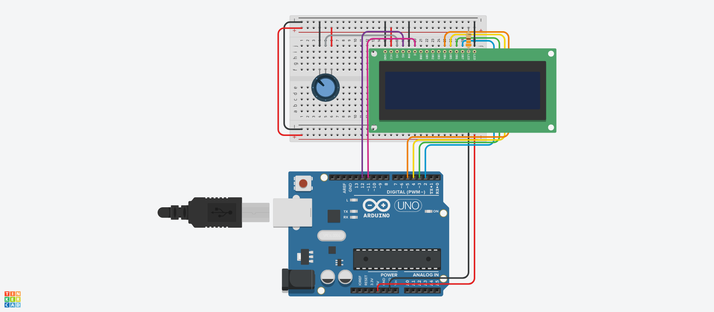
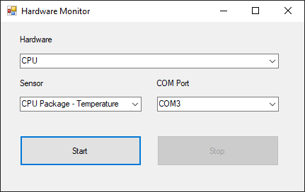

# Arduino Hardware Monitor

It prints information about temperature, clock, fan speed, power etc. of hardwares to lcd display.

## Requirments

### Dependencies

.NET Framework v4.7.2

Open Hardware Monitor v0.9.6 ([Source](https://github.com/openhardwaremonitor/openhardwaremonitor.git))

### Equipments

Arduino, LCD Display, Potentiometer, Resistor(330 Ω)

## Schema

## Screenshot

Please make sure you selected right com port for arduino.

